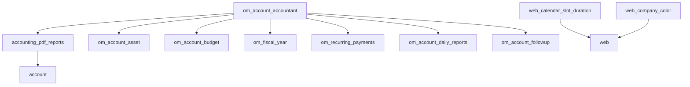

# Odoo 18 Modules Collection

A comprehensive collection of Odoo 18 modules focused on accounting, financial reporting, and web enhancements. This repository contains production-ready modules that extend Odoo's core functionality with advanced accounting features and improved user interface components.

## 📋 Table of Contents

- [Modules Overview](#modules-overview)
- [Installation](#installation)
- [Module Dependencies](#module-dependencies)
- [Configuration](#configuration)
- [Usage](#usage)
- [Contributing](#contributing)
- [License](#license)
- [Support](#support)

## 🚀 Modules Overview

### Accounting & Financial Modules

#### **accounting_pdf_reports**
- **Version**: 1.0.2
- **Description**: Comprehensive accounting financial reports for Odoo 18
- **Features**: 
  - Partner Ledger Reports
  - General Ledger Reports
  - Trial Balance Reports
  - Balance Sheet Reports
  - Profit & Loss Reports
  - Tax Reports
  - Aged Partner Reports
  - Journal Audit Reports

#### **om_account_accountant**
- **Version**: 1.0.3
- **Description**: Complete accounting community solution
- **Features**:
  - Accounting Reports
  - Asset Management and Budget
  - Recurring Payments
  - Lock Dates & Fiscal Year
  - Accounting Dashboard
  - Customer Follow-up Management
  - Bank Statement Import

#### **om_account_asset**
- **Description**: Asset management module for tracking and depreciating company assets

#### **om_account_budget**
- **Description**: Budget management and planning tools for financial control

#### **om_account_daily_reports**
- **Description**: Daily financial reporting and analytics

#### **om_account_followup**
- **Description**: Customer follow-up management for outstanding payments

#### **om_fiscal_year**
- **Description**: Fiscal year management and configuration

#### **om_recurring_payments**
- **Description**: Automated recurring payment processing

### Web Enhancement Modules

#### **web_calendar_slot_duration**
- **Version**: 18.0.1.0.0
- **Description**: Customizable calendar slot durations
- **Author**: Odoo Community Association (OCA)

#### **web_company_color**
- **Description**: Company-specific color theming for web interface

## 🔧 Installation

### Prerequisites
- Odoo 18.0 or higher
- Python 3.8+
- PostgreSQL 12+

### Installation Steps

1. **Clone the repository**:
   ```bash
   git clone <repository-url>
   cd odoo_modules
   ```

2. **Add to Odoo addons path**:
   Add the repository path to your Odoo configuration file (`odoo.conf`):
   ```ini
   addons_path = /path/to/your/addons,/path/to/odoo_modules
   ```

3. **Update Apps List**:
   - Log into your Odoo instance
   - Go to Apps menu
   - Enable Developer Mode
   - Click "Update Apps List"

4. **Install Modules**:
   - Search for the desired module
   - Click "Install"

### Recommended Installation Order

For the complete accounting solution, install in this order:
1. `accounting_pdf_reports`
2. `om_account_asset`
3. `om_account_budget`
4. `om_fiscal_year`
5. `om_recurring_payments`
6. `om_account_daily_reports`
7. `om_account_followup`
8. `om_account_accountant` (installs all dependencies)

## 📊 Module Dependencies



## ⚙️ Configuration

### Basic Setup
1. **Install the main accounting module**: `om_account_accountant`
2. **Configure Chart of Accounts**: Go to Accounting > Configuration > Chart of Accounts
3. **Set up Fiscal Year**: Configure your fiscal year periods
4. **Configure Journals**: Set up your accounting journals

### Module-Specific Configuration
- **Asset Management**: Configure asset categories and depreciation methods
- **Budget Management**: Set up budget structures and approval workflows
- **Follow-up**: Configure follow-up levels and email templates
- **Recurring Payments**: Set up payment schedules and automation rules

## 📈 Usage

### Financial Reports
Access comprehensive financial reports through:
- **Accounting > Reporting > Financial Reports**
- Generate PDF reports for:
  - Balance Sheet
  - Profit & Loss
  - Trial Balance
  - General Ledger
  - Partner Ledger

### Asset Management
- **Accounting > Assets**: Manage company assets and depreciation
- Track asset lifecycle from acquisition to disposal
- Automated depreciation calculations

### Budget Management
- **Accounting > Budget**: Create and monitor budgets
- Compare actual vs budgeted amounts
- Budget analysis and variance reports

## 🤝 Contributing

We welcome contributions! Please follow these guidelines:

1. Fork the repository
2. Create a feature branch (`git checkout -b feature/amazing-feature`)
3. Commit your changes (`git commit -m 'Add amazing feature'`)
4. Push to the branch (`git push origin feature/amazing-feature`)
5. Open a Pull Request

### Development Guidelines
- Follow Odoo development standards
- Include proper documentation
- Add tests for new features
- Update version numbers appropriately

## 📄 License

This project is licensed under the **LGPL-3.0** License - see individual module manifests for specific licensing information.

## 🆘 Support

### Getting Help
- **Email**: office.tassos@gmail.com
- **Website**: www.tassosconsultancy.com
- **Documentation**: Check individual module README files for detailed documentation

### Reporting Issues
Please report bugs and feature requests through the repository's issue tracker.

### Commercial Support
For commercial support and customization services, contact the maintainers.

---

## 📝 Module Versions

| Module | Version | Status |
|--------|---------|--------|
| accounting_pdf_reports | 1.0.2 | ✅ Stable |
| om_account_accountant | 1.0.3 | ✅ Stable |
| om_account_asset | - | ✅ Stable |
| om_account_budget | - | ✅ Stable |
| om_account_daily_reports | - | ✅ Stable |
| om_account_followup | - | ✅ Stable |
| om_fiscal_year | - | ✅ Stable |
| om_recurring_payments | - | ✅ Stable |
| web_calendar_slot_duration | 18.0.1.0.0 | ✅ Stable |
| web_company_color | - | ✅ Stable |

---

**Made with ❤️ by Odoo Community**
