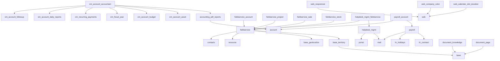

# Odoo 18 Modules Collection

A comprehensive collection of Odoo 18 modules covering accounting, field service management, helpdesk, payroll, document management, and web enhancements. This repository contains production-ready modules that extend Odoo's core functionality with advanced features across multiple business domains.

## 📋 Table of Contents

- [Modules Overview](#modules-overview)
- [Installation](#installation)
- [Module Dependencies](#module-dependencies)
- [Configuration](#configuration)
- [Usage](#usage)
- [Contributing](#contributing)
- [License](#license)
- [Support](#support)

## 🚀 Modules Overview

### 📊 Accounting & Financial Modules

#### **accounting_pdf_reports**
- **Version**: 1.0.2
- **Dependencies**: `account`
- **Description**: Comprehensive accounting financial reports for Odoo 18
- **Features**: 
  - Partner Ledger Reports
  - General Ledger Reports
  - Trial Balance Reports
  - Balance Sheet Reports
  - Profit & Loss Reports
  - Tax Reports
  - Aged Partner Reports
  - Journal Audit Reports

#### **om_account_accountant**
- **Version**: 1.0.3
- **Dependencies**: `accounting_pdf_reports`, `om_account_asset`, `om_account_budget`, `om_fiscal_year`, `om_recurring_payments`, `om_account_daily_reports`, `om_account_followup`
- **Description**: Complete accounting community solution
- **Features**:
  - Accounting Reports
  - Asset Management and Budget
  - Recurring Payments
  - Lock Dates & Fiscal Year
  - Accounting Dashboard
  - Customer Follow-up Management
  - Bank Statement Import

#### **om_account_asset**
- **Description**: Asset management module for tracking and depreciating company assets

#### **om_account_budget**
- **Description**: Budget management and planning tools for financial control

#### **om_account_daily_reports**
- **Description**: Daily financial reporting and analytics

#### **om_account_followup**
- **Description**: Customer follow-up management for outstanding payments

#### **om_fiscal_year**
- **Description**: Fiscal year management and configuration

#### **om_recurring_payments**
- **Description**: Automated recurring payment processing

### 🛠️ Field Service Management Modules

#### **fieldservice**
- **Version**: 18.0.1.2.1
- **Dependencies**: `base_territory`, `base_geolocalize`, `resource`, `contacts`
- **Description**: Core field service management functionality
- **Features**: Manage Field Service Locations, Workers and Orders

#### **base_territory**
- **Version**: 18.0.1.0.0
- **Dependencies**: `base`
- **Description**: Territory management for field service operations
- **Features**: Define territories, branches, districts and regions

#### Field Service Extensions:
- **fieldservice_account** - Accounting integration for field service
- **fieldservice_activity** - Activity management
- **fieldservice_agreement** - Service agreements
- **fieldservice_availability** - Worker availability management
- **fieldservice_calendar** - Calendar integration
- **fieldservice_crm** - CRM integration
- **fieldservice_equipment_stock** - Equipment stock management
- **fieldservice_equipment_warranty** - Equipment warranty tracking
- **fieldservice_kanban_info** - Kanban view enhancements
- **fieldservice_portal** - Customer portal integration
- **fieldservice_project** - Project management integration
- **fieldservice_recurring** - Recurring service orders
- **fieldservice_repair** - Repair order management
- **fieldservice_route** - Route optimization
- **fieldservice_route_availability** - Route availability management
- **fieldservice_sale** - Sales integration
- **fieldservice_sale_agreement** - Sales agreement integration
- **fieldservice_sale_agreement_equipment_stock** - Equipment stock for sales agreements
- **fieldservice_sale_recurring** - Recurring sales orders
- **fieldservice_sale_recurring_agreement** - Recurring agreement sales
- **fieldservice_sale_stock** - Stock integration for sales
- **fieldservice_size** - Size management
- **fieldservice_skill** - Skill-based assignment
- **fieldservice_stage_server_action** - Stage automation
- **fieldservice_stock** - Stock management
- **fieldservice_vehicle** - Vehicle management

### 🎫 Helpdesk Management Modules

#### **helpdesk_mgmt**
- **Version**: 18.0.1.12.0
- **Dependencies**: `mail`, `portal`
- **Description**: Core helpdesk management system
- **Features**: Complete helpdesk ticket management

#### Helpdesk Extensions:
- **helpdesk_mgmt_fieldservice** - Field service integration
- **helpdesk_mgmt_fieldservice_equipment** - Equipment management
- **helpdesk_mgmt_fieldservice_equipment_warranty** - Equipment warranty
- **helpdesk_mgmt_fieldservice_project** - Project integration
- **helpdesk_mgmt_merge** - Ticket merging
- **helpdesk_mgmt_portal_follower** - Portal follower management
- **helpdesk_mgmt_project** - Project management integration
- **helpdesk_mgmt_rating** - Customer rating system
- **helpdesk_mgmt_sale** - Sales integration
- **helpdesk_mgmt_sale_project** - Sales project integration
- **helpdesk_mgmt_sla** - Service Level Agreement management
- **helpdesk_mgmt_stage_validation** - Stage validation
- **helpdesk_mgmt_timesheet** - Timesheet integration
- **helpdesk_motive** - Ticket motive classification
- **helpdesk_portal_restriction** - Portal access restrictions
- **helpdesk_product** - Product-based helpdesk
- **helpdesk_ticket_partner_response** - Partner response tracking
- **helpdesk_ticket_related** - Related ticket management
- **helpdesk_type** - Ticket type management
- **helpdesk_type_sla** - Type-based SLA

### 💰 Payroll Management Modules

#### **payroll**
- **Version**: 18.0.1.1.3
- **Dependencies**: `hr_contract`, `hr_holidays`, `mail`
- **Description**: Core payroll management system
- **Features**: Employee payroll records management

#### **payroll_account**
- **Version**: 18.0.1.1.3
- **Dependencies**: `payroll`, `account`
- **Description**: Accounting integration for payroll
- **Features**: Payroll accounting entries and journal management

### 📄 Document Management Modules

#### **document_knowledge**
- **Version**: 18.0.1.0.1
- **Dependencies**: `base`
- **Description**: Knowledge management system
- **Features**: Document organization and knowledge base

#### Document Extensions:
- **document_page** - Document page management
- **document_page_access_group** - Access group management for documents
- **document_page_project** - Project document integration
- **document_url** - URL document management

### 🌐 Web Enhancement Modules

#### **web_calendar_slot_duration**
- **Version**: 18.0.1.0.0
- **Dependencies**: `web`
- **Description**: Customizable calendar slot durations
- **Author**: Odoo Community Association (OCA)

#### **web_company_color**
- **Dependencies**: `web`
- **Description**: Company-specific color theming for web interface

#### **web_replace_url**
- **Description**: URL replacement functionality

#### **web_responsive**
- **Description**: Responsive web interface enhancements

### 🔧 Utility Modules

#### **attachment_zipped_download**
- **Description**: Bulk attachment download as ZIP files

#### **resource_booking**
- **Description**: Resource booking and scheduling system

## 🔧 Installation

### Prerequisites
- Odoo 18.0 or higher
- Python 3.8+
- PostgreSQL 12+

### Installation Steps

1. **Clone the repository**:
   ```bash
   git clone <repository-url>
   cd odoo_modules
   ```

2. **Add to Odoo addons path**:
   Add the repository path to your Odoo configuration file (`odoo.conf`):
   ```ini
   addons_path = /path/to/your/addons,/path/to/odoo_modules
   ```

3. **Update Apps List**:
   - Log into your Odoo instance
   - Go to Apps menu
   - Enable Developer Mode
   - Click "Update Apps List"

4. **Install Modules**:
   - Search for the desired module
   - Click "Install"

### Recommended Installation Order

For the complete accounting solution, install in this order:
1. `accounting_pdf_reports`
2. `om_account_asset`
3. `om_account_budget`
4. `om_fiscal_year`
5. `om_recurring_payments`
6. `om_account_daily_reports`
7. `om_account_followup`
8. `om_account_accountant` (installs all dependencies)

## 📊 Module Dependencies



## ⚙️ Configuration

### Basic Setup
1. **Install the main accounting module**: `om_account_accountant`
2. **Configure Chart of Accounts**: Go to Accounting > Configuration > Chart of Accounts
3. **Set up Fiscal Year**: Configure your fiscal year periods
4. **Configure Journals**: Set up your accounting journals

### Module-Specific Configuration
- **Asset Management**: Configure asset categories and depreciation methods
- **Budget Management**: Set up budget structures and approval workflows
- **Follow-up**: Configure follow-up levels and email templates
- **Recurring Payments**: Set up payment schedules and automation rules

## 📈 Usage

### Financial Reports
Access comprehensive financial reports through:
- **Accounting > Reporting > Financial Reports**
- Generate PDF reports for:
  - Balance Sheet
  - Profit & Loss
  - Trial Balance
  - General Ledger
  - Partner Ledger

### Asset Management
- **Accounting > Assets**: Manage company assets and depreciation
- Track asset lifecycle from acquisition to disposal
- Automated depreciation calculations

### Budget Management
- **Accounting > Budget**: Create and monitor budgets
- Compare actual vs budgeted amounts
- Budget analysis and variance reports

## 🤝 Contributing

We welcome contributions! Please follow these guidelines:

1. Fork the repository
2. Create a feature branch (`git checkout -b feature/amazing-feature`)
3. Commit your changes (`git commit -m 'Add amazing feature'`)
4. Push to the branch (`git push origin feature/amazing-feature`)
5. Open a Pull Request

### Development Guidelines
- Follow Odoo development standards
- Include proper documentation
- Add tests for new features
- Update version numbers appropriately

## 📄 License

This project is licensed under the **LGPL-3.0** License - see individual module manifests for specific licensing information.

## 🆘 Support

### Getting Help
- **Email**: office.tassos@gmail.com
- **Website**: www.tassosconsultancy.com
- **Documentation**: Check individual module README files for detailed documentation

### Reporting Issues
Please report bugs and feature requests through the repository's issue tracker.

### Commercial Support
For commercial support and customization services, contact the maintainers.

---

## 📝 Complete Module Directory

### 📊 Accounting & Financial Modules (8 modules)
| Module | Version | Status | Dependencies |
|--------|---------|--------|--------------|
| accounting_pdf_reports | 1.0.2 | ✅ Stable | account |
| om_account_accountant | 1.0.3 | ✅ Stable | accounting_pdf_reports, om_account_asset, om_account_budget, om_fiscal_year, om_recurring_payments, om_account_daily_reports, om_account_followup |
| om_account_asset | - | ✅ Stable | - |
| om_account_budget | - | ✅ Stable | - |
| om_account_daily_reports | - | ✅ Stable | - |
| om_account_followup | - | ✅ Stable | - |
| om_fiscal_year | - | ✅ Stable | - |
| om_recurring_payments | - | ✅ Stable | - |

### 🛠️ Field Service Management Modules (27 modules)
| Module | Version | Status | Dependencies |
|--------|---------|--------|--------------|
| base_territory | 18.0.1.0.0 | ✅ Stable | base |
| fieldservice | 18.0.1.2.1 | ✅ Stable | base_territory, base_geolocalize, resource, contacts |
| fieldservice_account | - | ✅ Stable | fieldservice |
| fieldservice_activity | - | ✅ Stable | fieldservice |
| fieldservice_agreement | - | ✅ Stable | fieldservice |
| fieldservice_availability | - | ✅ Stable | fieldservice |
| fieldservice_calendar | - | ✅ Stable | fieldservice |
| fieldservice_crm | - | ✅ Stable | fieldservice |
| fieldservice_equipment_stock | - | ✅ Stable | fieldservice |
| fieldservice_equipment_warranty | - | ✅ Stable | fieldservice |
| fieldservice_kanban_info | - | ✅ Stable | fieldservice |
| fieldservice_portal | - | ✅ Stable | fieldservice |
| fieldservice_project | - | ✅ Stable | fieldservice |
| fieldservice_recurring | - | ✅ Stable | fieldservice |
| fieldservice_repair | - | ✅ Stable | fieldservice |
| fieldservice_route | - | ✅ Stable | fieldservice |
| fieldservice_route_availability | - | ✅ Stable | fieldservice |
| fieldservice_sale | - | ✅ Stable | fieldservice |
| fieldservice_sale_agreement | - | ✅ Stable | fieldservice |
| fieldservice_sale_agreement_equipment_stock | - | ✅ Stable | fieldservice |
| fieldservice_sale_recurring | - | ✅ Stable | fieldservice |
| fieldservice_sale_recurring_agreement | - | ✅ Stable | fieldservice |
| fieldservice_sale_stock | - | ✅ Stable | fieldservice |
| fieldservice_size | - | ✅ Stable | fieldservice |
| fieldservice_skill | - | ✅ Stable | fieldservice |
| fieldservice_stage_server_action | - | ✅ Stable | fieldservice |
| fieldservice_stock | - | ✅ Stable | fieldservice |
| fieldservice_vehicle | - | ✅ Stable | fieldservice |

### 🎫 Helpdesk Management Modules (17 modules)
| Module | Version | Status | Dependencies |
|--------|---------|--------|--------------|
| helpdesk_mgmt | 18.0.1.12.0 | ✅ Stable | mail, portal |
| helpdesk_mgmt_fieldservice | - | ✅ Stable | helpdesk_mgmt, fieldservice |
| helpdesk_mgmt_fieldservice_equipment | - | ✅ Stable | helpdesk_mgmt |
| helpdesk_mgmt_fieldservice_equipment_warranty | - | ✅ Stable | helpdesk_mgmt |
| helpdesk_mgmt_fieldservice_project | - | ✅ Stable | helpdesk_mgmt |
| helpdesk_mgmt_merge | - | ✅ Stable | helpdesk_mgmt |
| helpdesk_mgmt_portal_follower | - | ✅ Stable | helpdesk_mgmt |
| helpdesk_mgmt_project | - | ✅ Stable | helpdesk_mgmt |
| helpdesk_mgmt_rating | - | ✅ Stable | helpdesk_mgmt |
| helpdesk_mgmt_sale | - | ✅ Stable | helpdesk_mgmt |
| helpdesk_mgmt_sale_project | - | ✅ Stable | helpdesk_mgmt |
| helpdesk_mgmt_sla | - | ✅ Stable | helpdesk_mgmt |
| helpdesk_mgmt_stage_validation | - | ✅ Stable | helpdesk_mgmt |
| helpdesk_mgmt_timesheet | - | ✅ Stable | helpdesk_mgmt |
| helpdesk_motive | - | ✅ Stable | helpdesk_mgmt |
| helpdesk_portal_restriction | - | ✅ Stable | helpdesk_mgmt |
| helpdesk_product | - | ✅ Stable | helpdesk_mgmt |
| helpdesk_ticket_partner_response | - | ✅ Stable | helpdesk_mgmt |
| helpdesk_ticket_related | - | ✅ Stable | helpdesk_mgmt |
| helpdesk_type | - | ✅ Stable | helpdesk_mgmt |
| helpdesk_type_sla | - | ✅ Stable | helpdesk_mgmt |

### 💰 Payroll Management Modules (2 modules)
| Module | Version | Status | Dependencies |
|--------|---------|--------|--------------|
| payroll | 18.0.1.1.3 | ✅ Stable | hr_contract, hr_holidays, mail |
| payroll_account | - | ✅ Stable | payroll, account |

### 📄 Document Management Modules (4 modules)
| Module | Version | Status | Dependencies |
|--------|---------|--------|--------------|
| document_knowledge | 18.0.1.0.1 | ✅ Stable | base |
| document_page | - | ✅ Stable | base |
| document_page_access_group | - | ✅ Stable | document_page |
| document_page_project | - | ✅ Stable | document_page |
| document_url | - | ✅ Stable | base |

### 🌐 Web Enhancement Modules (4 modules)
| Module | Version | Status | Dependencies |
|--------|---------|--------|--------------|
| web_calendar_slot_duration | 18.0.1.0.0 | ✅ Stable | web |
| web_company_color | - | ✅ Stable | web |
| web_replace_url | - | ✅ Stable | web |
| web_responsive | - | ✅ Stable | web |

### 🔧 Utility Modules (2 modules)
| Module | Version | Status | Dependencies |
|--------|---------|--------|--------------|
| attachment_zipped_download | - | ✅ Stable | base |
| resource_booking | - | ✅ Stable | resource |

---

**Total Modules: 64**
- Accounting & Financial: 8 modules
- Field Service Management: 27 modules  
- Helpdesk Management: 17 modules
- Payroll Management: 2 modules
- Document Management: 5 modules
- Web Enhancement: 4 modules
- Utility: 2 modules

---

**Made with ❤️ by Odoo Community**
